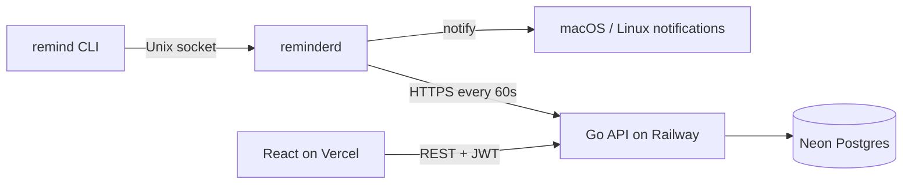

# Remindr

A lightweight desktop notification scheduler for macOS and Linux, with optional cloud sync across devices.

**Live demo**

| | URL |
|--|-----|
| Web dashboard | https://remindr.gfedolfi.dev |
| API health | https://remindr-production-52ef.up.railway.app/health |

[](https://github.com/c-fido/Remindr/actions/workflows/api.yml)
[](https://github.com/c-fido/Remindr/actions/workflows/web.yml)
[](https://github.com/c-fido/Remindr/actions/workflows/cpp.yml)

---

## What this is

Remindr works **fully offline** by default. Optionally sign in to sync reminders between your Mac/Linux CLI and the web dashboard.

| Component | Location | Role |
|-----------|----------|------|
| `remind` | `src/cli/` | CLI — add, list, delete reminders; login & sync |
| `reminderd` | `src/daemon/` | Background daemon — fires notifications, syncs every 60s |
| `Remindr.app` | `src/notify/` | macOS notification helper (Notification Center) |
| Go API | `api/` | Auth, CRUD, sync endpoint (Postgres) |
| Web app | `web/` | React dashboard |

---

## Architecture



**Sync model:** offline-first local JSON store; background push/pull via `POST /v1/sync` with last-write-wins merge and soft-delete tombstones. See [api/README.md](api/README.md) for API details.

---

## Try the live demo

1. Open https://remindr.gfedolfi.dev and **register** an account.
2. Create a reminder in the web UI.
3. On your Mac (with Remindr built and installed):

```sh
export REMINDR_API_URL=https://remindr-production-52ef.up.railway.app
remind login you@example.com
remind sync
remind list
```

The web reminder should appear locally. Changes made in either place sync on the next daemon tick (60s) or after `remind sync`.

---

## Install (local CLI + daemon)

### Requirements

| Tool | Version | Notes |
|------|---------|-------|
| CMake | ≥ 3.14 | |
| C++ compiler | C++17 | Clang or GCC |
| libcurl | any | Required for sync (`libcurl4-openssl-dev` on Debian/Ubuntu) |
| Swift compiler | any | macOS only — native notifications |
| Internet | first build | Fetches `nlohmann/json` automatically |

**macOS**

```sh
xcode-select --install
brew install cmake
```

**Debian/Ubuntu**

```sh
sudo apt install cmake g++ libcurl4-openssl-dev
```

### Build

```sh
git clone https://github.com/c-fido/Remindr.git
cd Remindr
cmake -B build -DCMAKE_BUILD_TYPE=Release
cmake --build build -j$(nproc 2>/dev/null || sysctl -n hw.ncpu)
```

Clean build: `rm -rf build` then reconfigure.

### Install binaries

Recommended — no `sudo`:

```sh
cmake --install build --prefix ~/.local
codesign -s - --deep --force ~/.local/bin/Remindr.app   # macOS only
```

Add to PATH:

```sh
# fish
fish_add_path ~/.local/bin

# bash / zsh
export PATH="$HOME/.local/bin:$PATH"
```

> Use `~/.local/bin/remind` and `~/.local/bin/reminderd`. If `/usr/local/bin/remind` is older, it will not have sync commands.

### Register as a startup service

Run **without `sudo`** as your login user:

```sh
remind --install
```

**macOS** — installs `~/Library/LaunchAgents/com.remind.reminderd.plist` and starts the daemon.

```sh
launchctl list com.remind.reminderd
launchctl print gui/$(id -u)/com.remind.reminderd | grep program
# → program = /Users/you/.local/bin/reminderd
```

**Linux** — installs a systemd user unit:

```sh
systemctl --user daemon-reload
systemctl --user enable --now reminderd
systemctl --user status reminderd
```

### macOS notification permission

The first time a reminder fires, approve **Remindr** in the system prompt. Or trigger manually:

```sh
~/.local/bin/Remindr.app/Contents/MacOS/remind-notify Remindr "Notifications enabled!"
```

Then check **System Settings → Notifications → Remindr**.

---

## Usage

### Add a reminder

Time tokens are detected from the end of the line — quotes optional:

```sh
remind coffee chat friday 3pm
remind call mom in 2 hours
remind standup tomorrow 9am --daily
remind team meeting monday at 10am --weekly
remind "take out the trash" tomorrow 8pm
```

| Pattern | Example |
|---------|---------|
| `in N minutes/hours/days/weeks` | `in 45 minutes` |
| `tomorrow` / `tomorrow <time>` | `tomorrow 9am` |
| `<weekday>` / `<weekday> at <time>` | `friday at 4pm` |
| `<time>` | `16:00` / `4:30pm` |

Weekday reminders fire on the **next** occurrence of that day. Clock-only times fire today if still ahead, otherwise tomorrow.

| Flag | Behaviour |
|------|-----------|
| `--daily` | Re-fires every 24 hours |
| `--weekly` | Re-fires every 7 days |

### List and delete

```sh
remind list
remind delete <id>    # UUID shown by remind list
```

### Notification sound

```sh
remind sound on
remind sound off
remind sound set ~/Downloads/my-sound.caf   # .caf / .aiff / .wav / .mp3
remind sound reset
```

---

## Remindr Sync

### Local-only vs sync mode

| Mode | How |
|------|-----|
| Local-only | Don't run `remind login` — works exactly as before |
| Sync | Register on the web app, then `remind login <email>` |

There is no `remind register` — create your account in the web dashboard first.

### Sync commands

```sh
remind login you@example.com    # prompts for password; saves tokens + API URL
remind sync                     # force sync now (via daemon)
remind status                   # last sync time, pending changes
remind logout                   # clear tokens; local reminders kept
```

### Point the CLI at an API

**Production (Railway):**

```sh
export REMINDR_API_URL=https://remindr-production-52ef.up.railway.app
```

**Local development:**

```sh
export REMINDR_API_URL=http://localhost:8080
```

No trailing slash on the URL.

The daemon runs under launchd/systemd and does **not** inherit your shell environment. On login, the API URL is saved to `~/.config/reminderd/credentials.json` so `reminderd` can sync without `REMINDR_API_URL` in the plist. Re-run `remind login` after changing the API URL.

### End-to-end sync flow

1. Web: create reminder → stored in Postgres via API.
2. CLI: `remind sync` → daemon pushes local changes, pulls server changes.
3. CLI: `remind list` → shows merged reminders.
4. Delete on either side → soft tombstone syncs to the other on next tick.

---

## How it works

`reminderd` runs a `select()`-based event loop with a 1-second tick. When `fire_at` passes, it fires a native notification:

| Platform | Mechanism |
|----------|-----------|
| macOS | `Remindr.app` via `UNUserNotificationCenter`; falls back to `osascript` |
| Linux | `notify-send` |

`remind` talks to the daemon over a Unix domain socket (`/tmp/reminderd.sock`) with newline-delimited JSON: `ADD`, `LIST`, `DELETE`, `SYNC`, `STATUS`.

When logged in, a background thread in `reminderd` calls `POST /v1/sync` every 60 seconds.

---

## File locations

| Path | Purpose |
|------|---------|
| `~/.config/reminderd/reminders_v2.json` | Reminder store (auto-migrates from v1) |
| `~/.config/reminderd/credentials.json` | JWT tokens + saved API URL |
| `~/.config/reminderd/sync_state.json` | Last sync timestamp, device ID |
| `~/.config/reminderd/config.json` | Sound on/off, custom sound path |
| `~/.config/reminderd/reminderd.log` | Daemon log (launchd/systemd) |
| `/tmp/reminderd.sock` | Unix socket |
| `~/.local/bin/Remindr.app` | macOS notification helper |

---

## Development

### API (`api/`)

```sh
cd api
cp .env.example .env          # DATABASE_URL, JWT_SECRET, WEB_ORIGIN
migrate -path migrations -database "$DATABASE_URL" up
go run ./cmd/server           # http://localhost:8080
```

See [api/README.md](api/README.md) for routes and curl examples.

**Production:** Railway (API) + Neon (Postgres). Set `WEB_ORIGIN` to your Vercel URL for CORS.

### Web (`web/`)

```sh
cd web
cp .env.example .env          # VITE_API_URL=http://localhost:8080
npm install && npm run dev    # http://localhost:5173
```

**Production:** Vercel with `VITE_API_URL` pointing at Railway. `vercel.json` handles SPA reload routing.

### C++ tests / CI

GitHub Actions builds and tests on push:

- `.github/workflows/cpp.yml` — cmake build (macOS + Ubuntu)
- `.github/workflows/api.yml` — `go test` with Postgres
- `.github/workflows/web.yml` — lint + build

---

## License

MIT — see [LICENSE](LICENSE).
